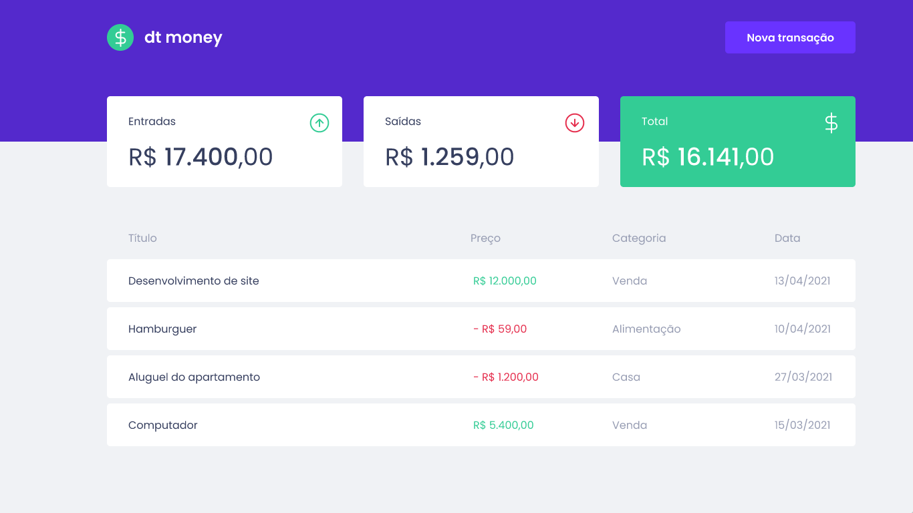
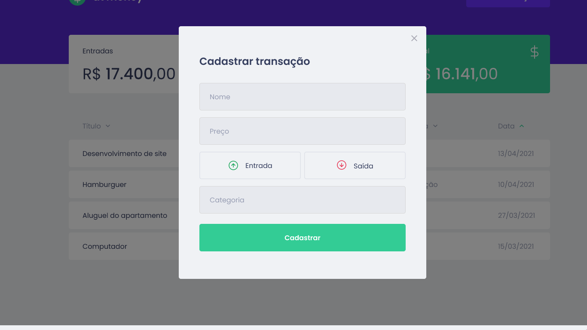

<h1 align="center">
    <br><br>
</h1>

<div>
    <div>
	    
	    <br><br>
    </div>
    <p align="center">
    <a href="https://www.linkedin.com/in/yuri-silva99/" target="_blank">
        
    </a>
    <a href="#">
        
    </a>
    <a href="#">
        
    </a>
  <br>
  <a href="#">
		
	</a>
    <a href="#">
        
    </a>
    </p>
</div>

## Table of Contents

<p align="center">
 <a href="#about">About</a> •
 <a href="#features">Features</a> •
 <a href="#revised-concepts">Revised Concepts</a> • 
 <a href="#installation">Installation</a> • 
 <a href="#getting-started">Get Started</a> • 
 <a href="#technologies">Technologies</a> • 
 <a href="#license">License</a>
</p>

## 📌About

<div>
    <p align="center">
dtMoney is an application developed with the aim of creating a platform that helps you to control your finances.
    </p>
</div>

## 🚀Features

- Financial Dashboard
- Insertion of Expenses and Profits

## 👓Revised Concepts

- Typing JS with Typescript
- Styling the app with Sass/Typescript
- React Fundaments (Hooks, Componentization, Context)
- React Modal
- API consumption with MirageJS and Axios

## 📕Installation

**You must have already installed**
- [Node.js](https://nodejs.org/en/)
- [Npm](https://www.npmjs.com/) or [Yarn](https://yarnpkg.com/)

**Recommendations**
-   It is recommended that you have installed Google Chrome or Edge
-   I recommend using VSCode as development IDE

**Let's divide it into 2 steps.**
1. Clone this repository
2. Install dependencies
  ---
### 1. Clone this repository
```
git clone https://github.com/Yuri-stack/Ignite_dtMoney.git
```
---
### 2. Install the dependencies
```
npm install
```
or
```
yarn
```

*Make sure your internet is stable, as this may take a while* 

## 🎮Getting Started

1. Run the project
```
yarn start
```
2. Now, open your browser and navigate to: http://localhost:3000

## 🌐Technologies

- [React ](https://reactjs.org/)
- [TypeScript](https://www.typescriptlang.org/)
- [Mirage JS](https://miragejs.com/)
- [Axios Docs](https://axios-http.com/docs/intro)
- [Sass](https://sass-lang.com/)

## 📝License

Released in 2021.

This project is under the [MIT license](https://github.com/Yuri-stack/Ignite_dtMoney/blob/main/LICENSE)

Made with love by [Yuri Oliveira](https://github.com/Yuri-stack) 🚀